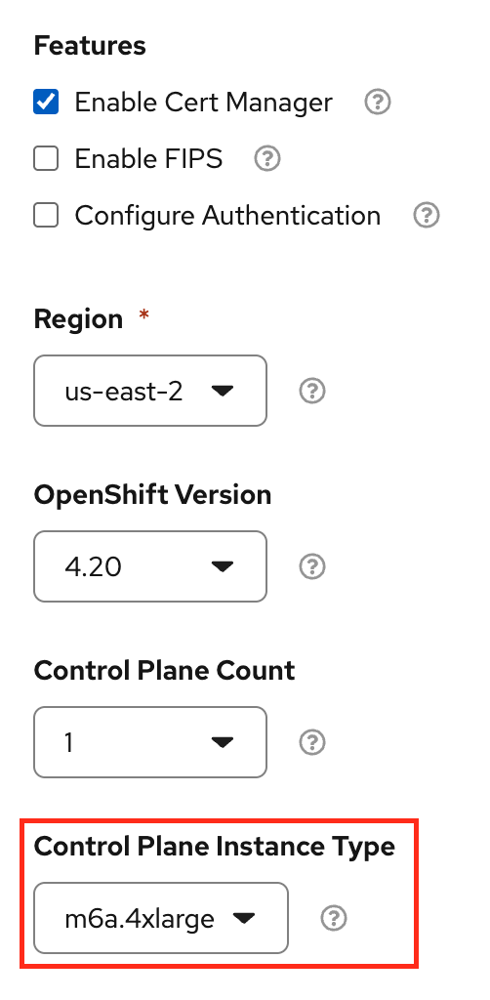

# Cluster Provisioning

This workshop was built and testing using OpenShift 4.20.31+.

If using the Red Hat Demo Platform, the [AWS with OpenShift Open Environment](https://catalog.demo.redhat.com/catalog/babylon-catalog-prod?item=babylon-catalog-prod/sandboxes-gpte.sandbox-ocp.prod&utm_source=webapp&utm_medium=share-link) is the recommended catalog item.  This catalog item is currently slated for retirement.  Future versions of this workshop should utilize the [Red Hat OpenShift Container Platform Cluster (Multi-Cloud)](https://catalog.demo.redhat.com/catalog/babylon-catalog-prod?item=babylon-catalog-prod/published.ocp4-cluster.prod&utm_source=webapp&utm_medium=share-link)

When requesting the AWS with OpenShift Open Environment, the following settings are recommended:

[]

Be sure to select the `m6a.4xlarge` control plane instance type as smaller instance types may experience out of memory errors.
